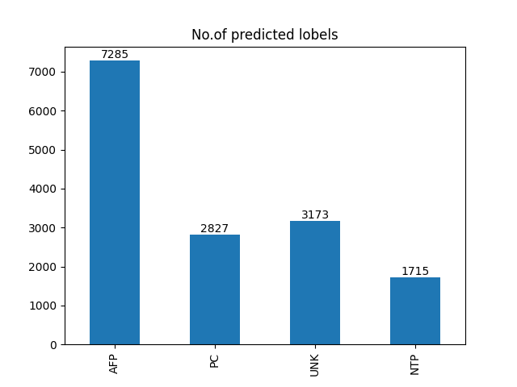

# Execution Details

1. Clone the repository using `git clone https://github.com/AsishGokarakonda/SOI_DataScience`.

2. Set up the python virtual environment using following commands:
    1) > python -m venv venv
    2) Activate virtual environment:
        > source venv/bin/activate #(for linux)

        > .\venv\Scripts\activate.ps1 #(for windows)

    2) > pip install -r requirements.txt

3. Now run the app using: `python3 app.py`

4. The app will start running at port 3000.

(Note: To deactivate the venv, just use: `deactivate`)

# Details about the Model

The Neural Network model created for the project has some larger initial layers which enable the computation, followed by gradually tapering layers which reduce the dimensionality of the information and bring it down to 4 in the last layer. It used categorical cross-entropy as the loss function and the adam optimizer. Some unrelated columns in the data have been dropped.

A pretrained version of the Model is being used in the project which had a training accuracy of around 83 percent. Incase the model isn't functioning properly (due to any versioning issues) we've provided the python note book to generate the model, and then use it in the webapp.

The model uses one-hot encoding for performing classification. 

The tce_rogue_flag, tce_insol and tce_insol_err columns are dropped since they are empty. Also kepid is dropped since it is only for unique identification purpose

# Details about the App

The webapp is designed using the flask API. It runs on the host computer at port 3000.

## Input csv file
The input csv file is a csv file which contains the following columns:
`kepid,tce_plnt_num,tce_rogue_flag,tce_period,tce_period_err,tce_time0bk,tce_time0bk_err,tce_impact,tce_impact_err,tce_duration,tce_duration_err,tce_depth,tce_depth_err,tce_model_snr,tce_prad,tce_prad_err,tce_eqt,tce_eqt_err,tce_insol,tce_insol_err,tce_steff,tce_steff_err,tce_slogg,tce_slogg_err,tce_sradius,tce_sradius_err` and has header.

Refer to sample input csv file [here](./files/sample_input.csv).

## Output csv file
Predicted results are obtained by a csv file containing the predicted labels by our keras model for given input data. It consists only `av_training_set` column with header.

Rows are of same order as the input csv file.

## How predictions are made
We first made a model using the problem dataset given [here](https://colab.research.google.com/drive/1kuyL5t8c6WfGCWK_PBxVk1aYgA3NNXG-?authuser=1#scrollTo=eZQ1gKMKe9iI). Then we saved the model in the [files/model](./files/model/) folder. In the flask web app,
we load the model using the `load_model` function. Then we make predictions for the input csv files using the `predict` function.

## Result Analysis
A basic bar chart is shown after prediction is done to show the distribution of the predicted labels. Sample image is shown below.

## Trouble Shooting
### 1. Error after submitting the input csv file (ValueError)
The error may be due to the incorrect input csv file. Check if the input csv file is in the correct format. Sample input csv file is [here](./files/sample_input.csv).

### 2. Not enough permissions to access `/files/` folder
The error may be due to opening the `/files/` folder in any other application. Try closing them. Also if you are using linux, make sure you have the permissions to access the folder.

### 3. Error while loading the model (AttributeError)
This error may be due to using different versions of tensorflow. Make sure you are using virtual environment. If you are still facing this error, then run the file [soi_nn_2.ipynb](./soi_nn_2.ipynb) to generate the model. This will generate the model in the `files/model` folder.
